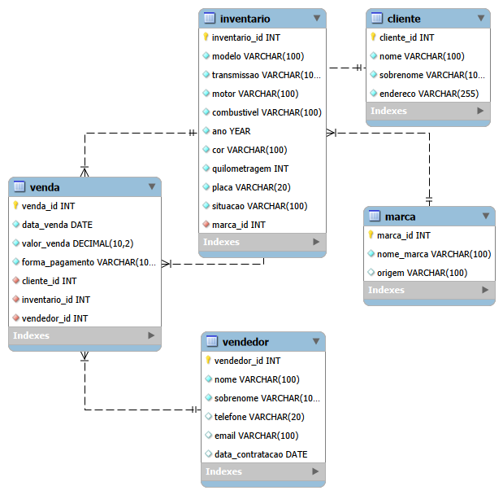

# Sistema de Banco de Dados para Concessionária

Projeto desenvolvido para praticar conceitos de modelagem de banco de dados e consultas SQL utilizando MySQL.

## Objetivo

O objetivo deste projeto é simular o funcionamento de uma concessionária, armazenando informações sobre:

- Marcas de veículos
- Clientes
- Vendedores
- Veículos em estoque
- Vendas realizadas

Além da criação das tabelas, o projeto demonstra consultas SQL desde o nível básico até consultas mais avançadas utilizando JOIN, GROUP BY, HAVING, SUBQUERIES, CASE e VIEW.

---

## Tecnologias utilizadas

- MySQL 8
- MySQL Workbench
- SQL

---

## Estrutura do projeto

```text
sql-concessionaria/
│
├── README.md
│
├── sql/
│   ├── 01_create_tables.sql
│   ├── 02_insert_data.sql
│   └── 03_queries.sql
│
└── images/
```

---

## Estrutura do banco

O banco de dados possui cinco tabelas relacionadas.

| Tabela | Descrição |
|---------|-----------|
| marca | Cadastro das marcas dos veículos |
| cliente | Cadastro dos clientes |
| vendedor | Cadastro dos vendedores |
| inventario | Veículos disponíveis e vendidos |
| venda | Histórico das vendas |

---

## Funcionalidades implementadas

- Criação do banco de dados
- Criação das tabelas
- Chaves primárias e estrangeiras
- Relacionamentos entre tabelas
- Inserção de dados
- Consultas SQL
- VIEW para histórico de vendas

---

## Consultas demonstradas

O projeto contém exemplos de:

- SELECT
- WHERE
- ORDER BY
- LIMIT
- INNER JOIN
- GROUP BY
- HAVING
- SUM
- COUNT
- AVG
- MAX
- MIN
- IN
- EXISTS
- CASE
- SUBQUERY
- VIEW

---

## Como executar

1. Execute o arquivo:

```text
01_create_tables.sql
```

2. Em seguida execute:

```text
02_insert_data.sql
```

3. Por último execute:

```text
03_queries.sql
```

---

## Diagrama do Banco de Dados



---

## Autor

**Vinícius Assumpção Francisco**

- GitHub: https://github.com/vinicius-assumpcao
- LinkedIn: www.linkedin.com/in/vinicius-assumpcao-francisco
